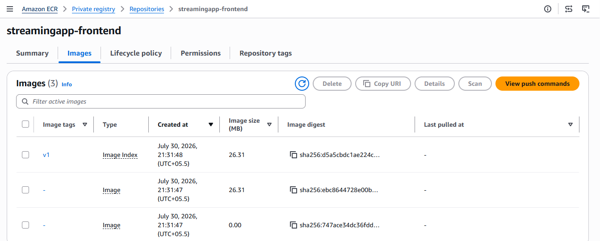

# 🚀 StreamingApp DevOps CI/CD Pipeline on AWS

> End-to-end CI/CD pipeline for a containerized MERN microservices application using **Jenkins**, **Docker**, **Amazon ECR**, **Amazon EKS**, **Helm**, and **Amazon CloudWatch**.


---

# 📖 Project Overview

Modern cloud-native applications require automated build, test, packaging, and deployment pipelines to ensure consistent and reliable software delivery.

This project demonstrates a production-inspired DevOps workflow for deploying a **containerized MERN-based microservices application** on **Amazon Elastic Kubernetes Service (EKS)** using **Jenkins** as the CI/CD platform.

The pipeline automates Docker image creation, stores images securely in **Amazon Elastic Container Registry (ECR)**, and deploys the application to Kubernetes using **Helm Charts**. Infrastructure monitoring is implemented using **Amazon CloudWatch**.

Although developed as part of a DevOps capstone project, the implementation follows several industry-standard DevOps practices including:

- Infrastructure automation
- Containerization
- CI/CD pipeline automation
- Kubernetes orchestration
- Helm package management
- Cloud-native monitoring
- IAM Role-based AWS authentication

---

# 🎯 Project Objectives

- Containerize a MERN microservices application using Docker.
- Build an automated CI/CD pipeline using Jenkins.
- Store container images securely in Amazon ECR.
- Deploy the application to Amazon EKS.
- Package Kubernetes manifests using Helm Charts.
- Configure CloudWatch monitoring and logging resources.
- Demonstrate Kubernetes-based application deployment and management.

---

# 🏗️ Solution Architecture

```text
                          Developer
                              │
                              ▼
                     GitHub Repository
                              │
                    (Source Code Push)
                              │
                              ▼
                    Jenkins CI/CD Pipeline
                              │
      ┌───────────────────────┼────────────────────────┐
      │                       │                        │
      ▼                       ▼                        ▼
 Build Frontend        Build Hello Service     Build Profile Service
 Docker Image           Docker Image            Docker Image
      │                       │                        │
      └───────────────────────┼────────────────────────┘
                              │
                              ▼
                      Amazon Elastic
                   Container Registry (ECR)
                              │
                              ▼
                     Amazon EKS Cluster
                              │
                        Helm Deployment
                              │
          ┌───────────────────┼───────────────────┐
          ▼                   ▼                   ▼
     Frontend Pod       Hello Service Pod    Profile Service Pod
                              │
                              ▼
                         MongoDB Pod
                              │
                              ▼
                  Amazon CloudWatch Monitoring
```

---

# ✨ Key Features

## 🚀 CI/CD

- Automated Jenkins pipeline
- GitHub source integration
- Docker image build automation
- Automatic image publishing to Amazon ECR

## 🐳 Containerization

- Dockerized frontend
- Dockerized backend microservices
- Docker Compose for local development
- Multi-service application architecture

## ☸️ Kubernetes

- Amazon EKS Cluster
- Kubernetes Deployments
- Kubernetes Services
- LoadBalancer service exposure
- ClusterIP services for internal communication
- ReplicaSet management

## 📦 Helm

- Reusable Helm Chart
- Parameterized deployment using `values.yaml`
- Kubernetes resource templating

## ☁️ AWS Services

- Amazon EC2
- Amazon ECR
- Amazon EKS
- IAM Roles
- CloudWatch
- VPC Networking

## 📈 Monitoring

- CloudWatch CPU Alarm
- CloudWatch Log Group
- Kubernetes resource monitoring

---

# 🛠️ Technology Stack

| Category | Technology |
|-----------|------------|
| Programming Language | JavaScript (Node.js) |
| Frontend | React |
| Backend | Express.js |
| Database | MongoDB |
| Containerization | Docker |
| Local Orchestration | Docker Compose |
| CI/CD | Jenkins |
| Source Control | Git & GitHub |
| Container Registry | Amazon ECR |
| Container Orchestration | Kubernetes |
| Managed Kubernetes | Amazon EKS |
| Package Manager | Helm |
| Cloud Platform | AWS |
| Monitoring | Amazon CloudWatch |
| Operating System | Ubuntu Linux |

---

# 📁 Project Structure

```text
streamingapp-devops/
│
├── app/
│   ├── frontend/
│   └── backend/
│       ├── helloService/
│       └── profileService/
│
├── helm/
│   └── streamingapp/
│       ├── Chart.yaml
│       ├── values.yaml
│       └── templates/
│
├── infrastructure/
│   └── eks-cluster.yaml
│
├── jenkins/
│   └── Jenkinsfile
│
├── docs/
│
├── assets/
│   └── screenshots/
│
├── docker-compose.yml
├── LICENSE
└── README.md
```

---

# 📷 Architecture & Project Preview

## StreamingApp User Interface


---

## Jenkins CI/CD Pipeline


---

## Amazon EKS Cluster


---

## Helm Deployment


---

# ⚙️ Prerequisites

Before deploying the application, ensure the following tools and AWS resources are available.

## Software Requirements

| Tool | Version |
|------|----------|
| Git | Latest |
| Docker | Latest |
| Docker Compose | Latest |
| Jenkins | Latest LTS |
| AWS CLI | v2 |
| kubectl | Compatible with EKS Cluster |
| eksctl | Latest |
| Helm | v3+ |

---

## AWS Services Used

- Amazon EC2
- Amazon ECR
- Amazon EKS
- Amazon CloudWatch
- IAM Roles
- VPC
- Security Groups

---

## IAM Permissions

The Jenkins EC2 instance uses an IAM Role with permissions for:

- Amazon ECR
- Amazon EKS
- Amazon EC2
- Amazon VPC
- AWS CloudFormation
- IAM

This eliminates the need to configure AWS Access Keys on the Jenkins server.

---

# 🚀 Project Setup

## Clone Repository

```bash
git clone https://github.com/<your-github-username>/streamingapp-devops.git

cd streamingapp-devops
```

---

## Project Components

The project consists of four containerized services:

| Service | Port |
|----------|------|
| Frontend (React + Nginx) | 80 |
| Hello Service | 3001 |
| Profile Service | 3002 |
| MongoDB | 27017 |

---

## Local Development

The application can be started locally using Docker Compose.

```bash
docker compose up -d
```

Verify running containers:

```bash
docker ps
```

Stop the application:

```bash
docker compose down
```

---

# 🐳 Docker Containerization

Each application component has its own Dockerfile.

```
Frontend
    │
    ▼
Docker Image
    │
    ▼
Amazon ECR

Hello Service
    │
    ▼
Docker Image
    │
    ▼
Amazon ECR

Profile Service
    │
    ▼
Docker Image
    │
    ▼
Amazon ECR
```

---

## Docker Images

The following images are built during the pipeline.

| Image |
|--------|
| streamingapp-frontend |
| streamingapp-hello |
| streamingapp-profile |

---

## Docker Compose

Docker Compose is used during local development to orchestrate:

- MongoDB
- Hello Service
- Profile Service
- Frontend

---

### Docker Images


---

### Docker Compose Deployment


---

# 📦 Amazon Elastic Container Registry (ECR)

Amazon ECR serves as the centralized container registry for storing Docker images generated by the Jenkins pipeline.

Each successful pipeline execution:

- Builds Docker images
- Tags images
- Authenticates with Amazon ECR
- Pushes updated images to private repositories

---

## Private Repositories

| Repository |
|------------|
| streamingapp-frontend |
| streamingapp-hello |
| streamingapp-profile |

---

### Amazon ECR Repositories


---

### Image Versions



---

# 🔄 Jenkins CI/CD Pipeline

Jenkins automates the complete build workflow from source code to container registry.

The pipeline is defined in:

```
jenkins/Jenkinsfile
```

---

## Pipeline Workflow

```
GitHub Push
      │
      ▼
Checkout Source Code
      │
      ▼
Verify Docker & AWS CLI
      │
      ▼
Authenticate to Amazon ECR
      │
      ▼
Build Frontend Image
      │
      ▼
Build Hello Service Image
      │
      ▼
Build Profile Service Image
      │
      ▼
Tag Images
      │
      ▼
Push Images to Amazon ECR
      │
      ▼
Pipeline Completed
```

---

## Jenkins Pipeline Stages

- Checkout Source Code
- Verify Build Environment
- Authenticate to Amazon ECR
- Build Frontend Image
- Build Hello Service Image
- Build Profile Service Image
- Tag Docker Images
- Push Images to Amazon ECR
- Post Build Actions

---

## Jenkins Dashboard


---

## Successful Pipeline Execution


---

## Docker Access Verification

Jenkins was configured with Docker permissions by adding the Jenkins user to the Docker group, allowing pipeline stages to build and push container images without requiring elevated privileges.

---

## CI/CD Outcome

Each GitHub push automatically performs:

- Source code checkout
- Docker image build
- Image tagging
- Image upload to Amazon ECR

The resulting container images are then available for deployment to Amazon EKS using Helm.

---

# ☸️ Amazon Elastic Kubernetes Service (EKS)

After successfully building and publishing the application images to Amazon Elastic Container Registry (ECR), the next phase was deploying the application to a managed Kubernetes environment using **Amazon EKS**.

Amazon EKS provides a fully managed Kubernetes control plane while allowing worker nodes to run on Amazon EC2 instances.

---

## EKS Cluster Configuration

The Kubernetes cluster was provisioned using **eksctl** with a declarative cluster configuration file.

```
infrastructure/
└── eks-cluster.yaml
```

The cluster includes:

- Kubernetes v1.36
- Managed Node Group
- Amazon Linux 2023 Worker Node
- IAM OIDC Provider
- Public API Endpoint
- gp3 EBS Storage
- Auto-managed networking

---

## Cluster Verification

Verify the Kubernetes cluster.

```bash
kubectl get nodes
```

Expected output:

```text
NAME                                            STATUS   ROLES   VERSION
ip-192-168-54-94.ap-south-1.compute.internal    Ready    <none>  v1.36.x
```

---

### Amazon EKS Cluster


---

# 📦 Helm Deployment

Instead of manually applying multiple Kubernetes manifests, the application is packaged as a reusable **Helm Chart**.

Helm simplifies application deployment by allowing Kubernetes resources to be managed as a single versioned package.

---

## Helm Chart Structure

```
helm/
└── streamingapp/
    ├── Chart.yaml
    ├── values.yaml
    ├── .helmignore
    └── templates/
        ├── frontend.yaml
        ├── hello.yaml
        ├── profile.yaml
        ├── mongodb.yaml
        └── _helpers.tpl
```

---

## Helm Components

### Chart.yaml

Contains metadata describing the application.

### values.yaml

Stores configurable values including:

- Docker image repositories
- Image tags
- Service ports
- MongoDB configuration

### templates/

Contains Kubernetes manifests for:

- Frontend Deployment & Service
- Hello Service Deployment & Service
- Profile Service Deployment & Service
- MongoDB Deployment & Service

---

## Helm Installation

Deploy the application.

```bash
helm install streamingapp helm/streamingapp
```

Upgrade deployment.

```bash
helm upgrade streamingapp helm/streamingapp
```

List Helm releases.

```bash
helm list
```

---

### Helm Chart


---

### Helm Deployment


---

# ☸️ Kubernetes Resources

After Helm deployment, Kubernetes creates the required resources automatically.

---

## Deployments

| Deployment |
|------------|
| frontend |
| hello-service |
| profile-service |
| mongodb |

---

## Services

| Service | Type |
|----------|------|
| frontend | LoadBalancer |
| hello-service | ClusterIP |
| profile-service | ClusterIP |
| mongodb | ClusterIP |

---

## ReplicaSets

Each deployment creates a ReplicaSet responsible for maintaining the desired number of running Pods.

---

## Pods

The application consists of four running Pods:

- Frontend
- Hello Service
- Profile Service
- MongoDB

---

### Kubernetes Resources


---

### Kubernetes Services


---

### Worker Node


---

# 📊 Monitoring with Amazon CloudWatch

Amazon CloudWatch was configured to monitor the deployed infrastructure.

---

## CloudWatch Alarm

A CPU utilization alarm monitors the EKS worker node.

Configuration:

| Property | Value |
|----------|-------|
| Metric | CPUUtilization |
| Threshold | > 80% |
| Period | 5 Minutes |
| Statistic | Average |

This alarm helps identify high CPU usage that could indicate increased application load or resource constraints.

---

### CloudWatch Alarm


---

# 📑 CloudWatch Logs

A CloudWatch Log Group was created to organize application logs.

```
Log Group
└── streamingapp-logs
```

> **Note**
>
> In this project, a CloudWatch Log Group was created to prepare centralized logging. In a production environment, application and Kubernetes logs would typically be forwarded to this log group using the Amazon CloudWatch Agent or Fluent Bit.

---

### CloudWatch Log Group


---

# ✅ Deployment Validation

The following commands were used to validate the Kubernetes deployment.

---

## Verify Worker Nodes

```bash
kubectl get nodes
```

---

## Verify Pods

```bash
kubectl get pods
```

---

## Verify All Resources

```bash
kubectl get all
```

---

## Verify Services

```bash
kubectl get svc
```

---

## Verify Helm Release

```bash
helm list
```

---

## Verify Frontend Service

Retrieve the LoadBalancer endpoint.

```bash
kubectl get svc frontend
```

Open the External LoadBalancer URL in a browser to verify the application is accessible.

---

# 🎯 Deployment Outcome

The deployment was successfully completed with the following results:

- ✅ Amazon EKS Cluster Provisioned
- ✅ Worker Node Ready
- ✅ Helm Chart Created
- ✅ Helm Release Successfully Installed
- ✅ Frontend Exposed via LoadBalancer
- ✅ Backend Services Running
- ✅ MongoDB Running
- ✅ CloudWatch Alarm Configured
- ✅ CloudWatch Log Group Created
- ✅ Kubernetes Resources Successfully Validated

---

# 📸 Project Screenshots

The following screenshots capture the key milestones of the project implementation.

---

## Application

### StreamingApp User Interface


---

## Docker

### Docker Images


### Docker Compose Deployment


---

## Amazon Elastic Container Registry (ECR)

### Private Repositories


---

## Jenkins CI/CD

### Jenkins Dashboard


### Successful Pipeline Execution


---

## Amazon EKS

### EKS Cluster Ready


### Helm Deployment


### Kubernetes Resources


### Kubernetes Services


---

## Amazon CloudWatch

### CPU Monitoring Alarm


### CloudWatch Log Group


---

# 🔧 Troubleshooting

Throughout the implementation, several practical challenges were encountered and resolved.

| Issue | Resolution |
|--------|------------|
| Jenkins Docker permission denied | Added the `jenkins` user to the Docker group and restarted the Jenkins service. |
| GitHub HTTPS authentication failed | Generated a GitHub Personal Access Token (PAT) and used it for Git operations. |
| Amazon ECR authentication | Configured AWS CLI authentication using the EC2 IAM Role and performed Docker login to ECR. |
| Kubernetes version compatibility | Updated the `eksctl` cluster configuration to use a supported Kubernetes version and Amazon Linux 2023 AMI family. |
| Helm deployment validation | Used `helm lint` before deployment to identify template issues. |
| CloudWatch alarm configuration | Created the alarm without notification actions, as SNS integration was outside the required project scope. |
| Missing `.env` files on EC2 | Verified that environment files were intentionally excluded from Git and recreated the required configuration for Kubernetes deployment. |

---

# 🚀 Future Improvements

Potential enhancements for a production-ready implementation include:

- Deploy MongoDB using a StatefulSet with PersistentVolumes.
- Configure Horizontal Pod Autoscaler (HPA) for application scaling.
- Implement Ingress using the AWS Load Balancer Controller.
- Automate infrastructure provisioning using Terraform.
- Implement GitOps deployment with Argo CD.
- Store sensitive configuration in AWS Secrets Manager or Kubernetes Secrets.
- Integrate Prometheus and Grafana for advanced monitoring.
- Forward Kubernetes application logs to CloudWatch using Fluent Bit or the CloudWatch Agent.
- Add automated container image security scanning (for example, Trivy).
- Implement automated rollback strategies during deployments.

---

# 🎓 Learning Outcomes

This project provided practical experience in building and deploying cloud-native applications using modern DevOps practices.

Key areas of learning include:

- Containerizing microservices using Docker.
- Managing multi-container applications with Docker Compose.
- Designing and implementing CI/CD pipelines using Jenkins.
- Authenticating AWS services using IAM Roles.
- Publishing Docker images to Amazon Elastic Container Registry (ECR).
- Provisioning and managing Kubernetes clusters with Amazon EKS.
- Packaging Kubernetes resources using Helm Charts.
- Deploying and validating applications on Kubernetes.
- Configuring CloudWatch monitoring resources.
- Troubleshooting real-world deployment and infrastructure issues.
- Applying Git and GitHub workflows for source code management.

---

# 📌 Key Takeaways

- Automated CI/CD pipelines improve deployment consistency and reduce manual effort.
- Containerization simplifies application portability across environments.
- Kubernetes provides scalable and resilient application orchestration.
- Helm enables reusable and manageable Kubernetes deployments.
- IAM Roles provide a secure alternative to long-lived AWS access keys.
- Cloud-native monitoring is essential for operational visibility and reliability.

---

# 👨‍💻 Author

**Rinku Chauhan**

Senior System Engineer | DevOps & Cloud Engineering Enthusiast

- 💼 LinkedIn: https://linkedin.com/in/rinku-chauhan

---

# 📄 License

This project is licensed under the **MIT License**.

See the [LICENSE](LICENSE) file for additional information.

---

# 🙏 Acknowledgements

This project was developed as part of the **Hero Vired Postgraduate Program in Multi-Cloud Architecture & DevOps**.

Special thanks to the instructors, mentors, and the open-source community for the tools and technologies that made this implementation possible.

---

⭐ If you found this project useful, consider giving the repository a star!