<div align="center">

# StreamingApp DevOps CI/CD Pipeline on AWS

### End-to-End CI/CD for a Containerized MERN Microservices Application using Jenkins, Docker, Amazon ECR, Amazon EKS, Helm & CloudWatch


</div>

---

# Table of Contents

- [Project Overview](#-project-overview)
- [Solution Architecture](#️-solution-architecture)
- [Key Highlights](#-key-highlights)
- [Key Features](#-key-features)
- [Technology Stack](#️-technology-stack)
- [Project Metrics](#-project-metrics)
- [Project Structure](#-project-structure)
- [Prerequisites](#️-prerequisites)
- [Project Setup](#-project-setup)
- [Docker & Amazon ECR](#-docker--amazon-ecr)
- [Jenkins CI/CD Pipeline](#-jenkins-cicd-pipeline)
- [Amazon EKS & Helm Deployment](#️-amazon-eks--helm-deployment)
- [CloudWatch Monitoring](#-cloudwatch-monitoring)
- [Deployment Verification](#-deployment-verification)
- [Project Screenshots](#-project-screenshots)
- [Troubleshooting](#-troubleshooting)
- [Future Improvements](#-future-improvements)
- [Author](#-author)

---

# Project Overview

This project demonstrates an end-to-end DevOps implementation for deploying a containerized MERN microservices application on **Amazon Elastic Kubernetes Service (EKS)**.

The solution automates the software delivery lifecycle using **Jenkins**, **Docker**, **Amazon Elastic Container Registry (ECR)**, **Helm**, and **Amazon CloudWatch**. It showcases modern DevOps practices including containerization, continuous integration, Kubernetes orchestration, cloud-native deployment, and infrastructure monitoring.

---

# Solution Architecture

> **Note:** Replace the ASCII diagram below with a professional architecture diagram (`assets/architecture.png`) for a stronger portfolio presentation.

```text
                 Developer
                      │
                Git Push
                      │
                      ▼
             GitHub Repository
                      │
                      ▼
             Jenkins CI/CD Pipeline
                      │
          Build Docker Images
                      │
                      ▼
              Amazon ECR
                      │
          Pull Container Images
                      ▼
          Amazon EKS Cluster
                      │
             Helm Deployment
                      │
      ┌───────────────┼───────────────┐
      ▼               ▼               ▼
 Frontend        Hello Service   Profile Service
                      │
                      ▼
                   MongoDB
                      │
                      ▼
          Amazon CloudWatch
```

---

# Key Highlights

- Automated CI/CD pipeline using Jenkins
- Dockerized MERN microservices architecture
- Private container registry using Amazon ECR
- Kubernetes deployment on Amazon EKS
- Helm-based Kubernetes package management
- Infrastructure monitoring with Amazon CloudWatch
- Secure AWS authentication using IAM Roles
- Cloud-native deployment on AWS

---

# Key Features

### CI/CD

- Automated Jenkins pipeline
- GitHub source integration
- Docker image build and publishing
- Continuous deployment workflow

### Containerization

- Dockerized React frontend
- Dockerized Node.js microservices
- MongoDB container
- Docker Compose for local development

### Kubernetes

- Amazon EKS managed cluster
- Kubernetes Deployments & Services
- LoadBalancer and ClusterIP services
- Helm-based deployments

### Monitoring

- Amazon CloudWatch CPU Alarm
- CloudWatch Log Group
- Kubernetes resource validation

---

# Technology Stack

| Category | Technologies |
|-----------|--------------|
| Cloud | AWS EC2, Amazon EKS, Amazon ECR, CloudWatch, IAM |
| DevOps | Jenkins, Docker, Kubernetes, Helm |
| Application | React, Node.js, Express.js, MongoDB |
| Version Control | Git, GitHub |
| Operating System | Ubuntu Linux |

---

# Project Metrics

| Metric | Value |
|---------|------:|
| Microservices | 3 |
| Database | 1 |
| Docker Images | 3 |
| Kubernetes Pods | 4 |
| Kubernetes Services | 4 |
| Helm Charts | 1 |
| EKS Node Groups | 1 |
| CI/CD Platform | Jenkins |
| Cloud Provider | AWS |

---
# Project Structure

```text
streamingapp-devops/
│
├── app/
│   ├── frontend/
│   └── backend/
│       ├── helloService/
│       └── profileService/
│
├── helm/
│   └── streamingapp/
│
├── infrastructure/
│   └── eks-cluster.yaml
│
├── jenkins/
│   └── Jenkinsfile
│
├── docs/
├── assets/
│   └── screenshots/
│
├── docker-compose.yml
├── LICENSE
└── README.md
```

---

# Prerequisites

## Software

| Tool | Version |
|------|---------|
| Git | Latest |
| Docker & Docker Compose | Latest |
| Jenkins | LTS |
| AWS CLI | v2 |
| kubectl | Compatible with EKS |
| eksctl | Latest |
| Helm | v3+ |

---

## AWS Services

- Amazon EC2
- Amazon ECR
- Amazon EKS
- Amazon CloudWatch
- IAM
- VPC

---

## IAM Authentication

The Jenkins EC2 instance uses an **IAM Role** for AWS authentication, allowing secure access to ECR, EKS, EC2, CloudFormation, and other AWS services without storing long-lived access keys.

---

# Project Setup

## Clone the Repository

```bash
git clone https://github.com/<your-github-username>/streamingapp-devops.git

cd streamingapp-devops
```

---

## Local Development

Start all services locally using Docker Compose.

```bash
docker compose up -d
```

Verify running containers.

```bash
docker ps
```

Stop the application.

```bash
docker compose down
```

---

# Docker & Amazon ECR

Each application component is containerized using Docker.

## Containerized Services

| Service | Port |
|----------|------|
| Frontend (React + Nginx) | 80 |
| Hello Service | 3001 |
| Profile Service | 3002 |
| MongoDB | 27017 |

---

## Docker Images

The Jenkins pipeline builds three application images:

- `streamingapp-frontend`
- `streamingapp-hello`
- `streamingapp-profile`

These images are pushed to private repositories in **Amazon Elastic Container Registry (ECR)**.

---

### Docker Images

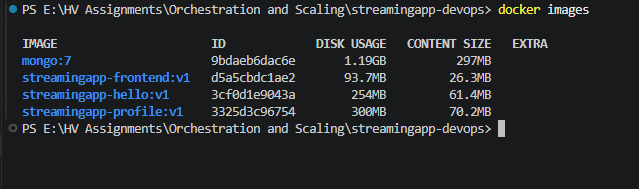

---

### Docker Compose Deployment

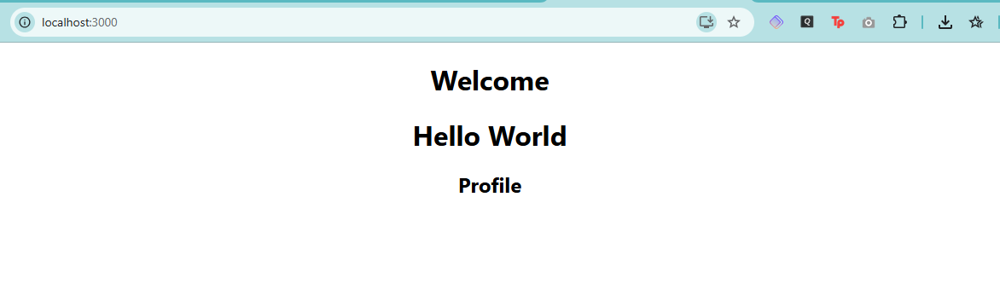

---

### Amazon ECR Repositories

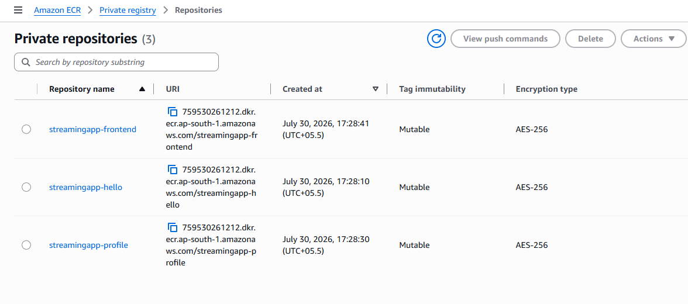

---

# 🔄 Jenkins CI/CD Pipeline

The CI/CD pipeline is implemented using **Jenkins Pipeline** and defined in:

```text
jenkins/Jenkinsfile
```

Each code change triggers an automated workflow that builds, tags, and publishes Docker images.

---

## Pipeline Workflow

```text
GitHub Push
      │
      ▼
Checkout Source Code
      │
      ▼
Build Docker Images
      │
      ▼
Authenticate to Amazon ECR
      │
      ▼
Push Images to Amazon ECR
      │
      ▼
Ready for Kubernetes Deployment
```

---

## Pipeline Stages

- Source Code Checkout
- Docker Image Build
- Amazon ECR Authentication
- Image Tagging
- Image Push
- Post-build Validation

---

### Jenkins Dashboard

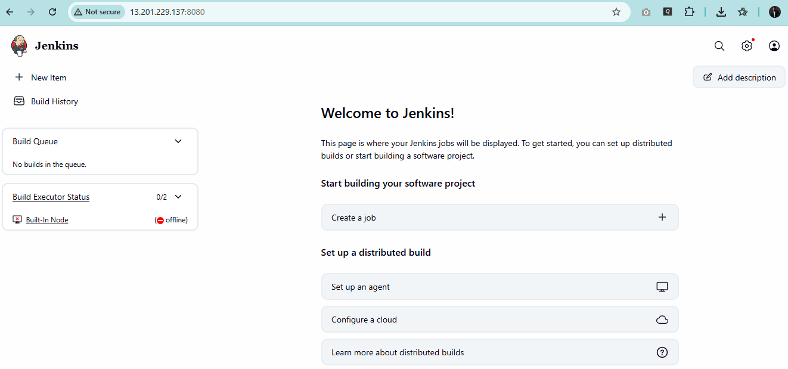

---

### Successful Pipeline

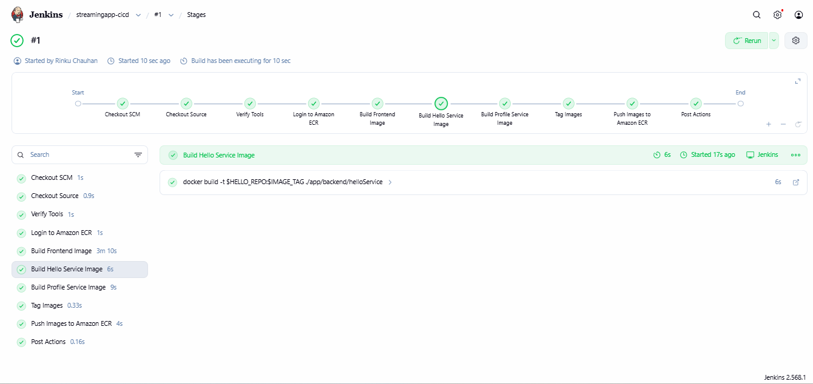

---

## CI/CD Outcome

The Jenkins pipeline automates the complete container build process, ensuring that every successful code change results in updated Docker images stored in Amazon ECR, ready for deployment to Amazon EKS.
---
# Amazon Elastic Kubernetes Service (EKS)

After successfully publishing Docker images to Amazon ECR, the application is deployed to a managed Kubernetes cluster using **Amazon Elastic Kubernetes Service (EKS)**.

The cluster was provisioned using **eksctl** with a declarative cluster configuration.

```text
infrastructure/
└── eks-cluster.yaml
```

### Cluster Configuration

- Kubernetes v1.36
- Managed Node Group
- Amazon Linux 2023 Worker Node
- IAM OIDC Provider Enabled
- gp3 Storage
- Public API Endpoint

---

### Amazon EKS Cluster

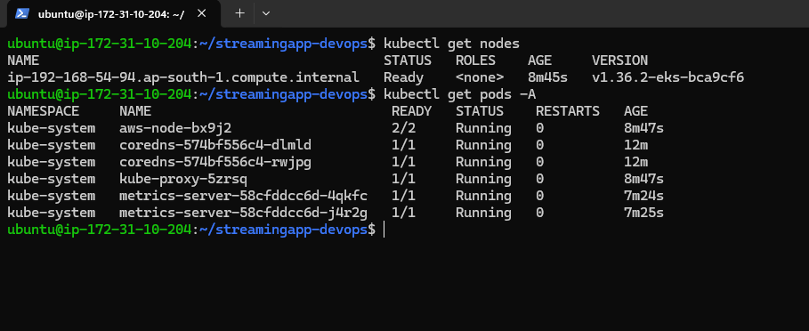

---

# Helm Deployment

The Kubernetes application is packaged using **Helm**, enabling consistent, repeatable, and version-controlled deployments.

```text
helm/
└── streamingapp/
    ├── Chart.yaml
    ├── values.yaml
    └── templates/
```

The Helm chart deploys:

- Frontend
- Hello Service
- Profile Service
- MongoDB

Deploy the application:

```bash
helm install streamingapp helm/streamingapp
```

Upgrade an existing deployment:

```bash
helm upgrade streamingapp helm/streamingapp
```

List installed releases:

```bash
helm list
```

---

### Helm Deployment

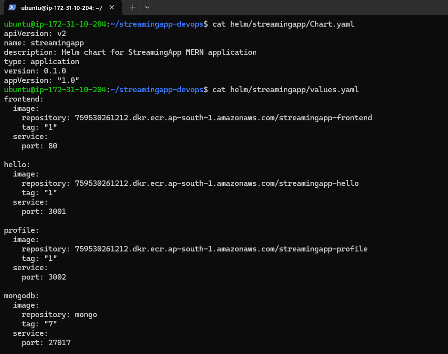

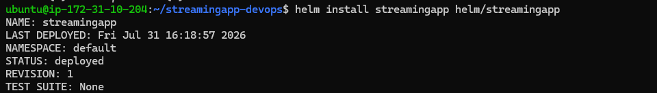

---

# Kubernetes Resources

After the Helm deployment, Kubernetes automatically creates and manages the required resources.

| Resource | Count |
|----------|------:|
| Deployments | 4 |
| Pods | 4 |
| Services | 4 |
| ReplicaSets | 4 |

### Services

| Service | Type |
|----------|------|
| Frontend | LoadBalancer |
| Hello Service | ClusterIP |
| Profile Service | ClusterIP |
| MongoDB | ClusterIP |

---

### Kubernetes Resources

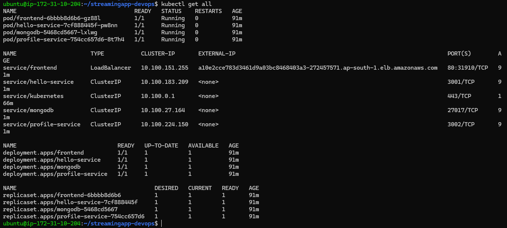

---

### Kubernetes Services

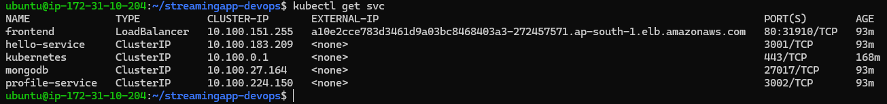

---

### Worker Node

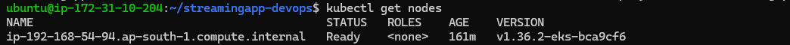

---

# CloudWatch Monitoring

Amazon CloudWatch is used to monitor the Kubernetes infrastructure.

### Configured Resources

- CPU Utilization Alarm
- CloudWatch Log Group

The CPU alarm monitors the EKS worker node and can be extended with SNS notifications for production environments.

---

### CloudWatch Alarm

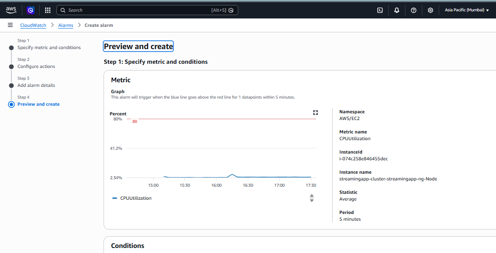

---

### CloudWatch Log Group

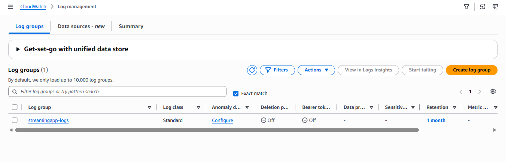

> **Note**
>
> A CloudWatch Log Group has been created as part of the monitoring setup. In a production environment, Kubernetes and application logs would typically be forwarded to this log group using Fluent Bit or the Amazon CloudWatch Agent.

---

# Deployment Verification

The following commands were used to validate the deployment.

### Verify Worker Nodes

```bash
kubectl get nodes
```

---

### Verify Kubernetes Resources

```bash
kubectl get all
```

---

### Verify Services

```bash
kubectl get svc
```

---

### Verify Helm Release

```bash
helm list
```

---

## Deployment Result

The application was successfully deployed and verified on Amazon EKS.

✔ Amazon EKS Cluster Provisioned

✔ Helm Chart Successfully Deployed

✔ Frontend Exposed via LoadBalancer

✔ Backend Microservices Running

✔ MongoDB Running

✔ CloudWatch Monitoring Configured

✔ Kubernetes Resources Validated
---
# Project Screenshots

The following screenshots highlight the major milestones of the project.

| Stage | Screenshot |
|--------|------------|
| StreamingApp User Interface | 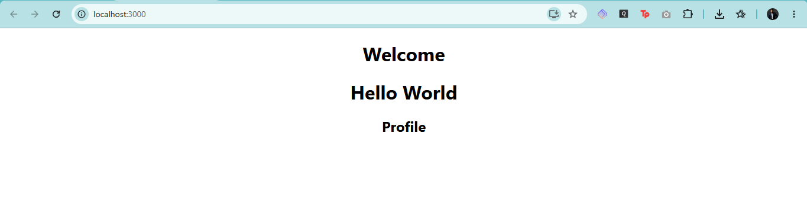 |
| Docker Images |  |
| Docker Compose |  |
| Amazon ECR Repositories |  |
| Jenkins Dashboard |  |
| Successful Jenkins Pipeline |  |
| Amazon EKS Cluster |  |
| Helm Deployment |  |
| Kubernetes Resources |  |
| CloudWatch Monitoring |  |

> **Note:** Additional implementation screenshots are available in the `assets/screenshots` directory.

---

# Troubleshooting

During implementation, several common DevOps challenges were encountered and resolved.

| Issue | Resolution |
|-------|------------|
| Jenkins could not access Docker | Added the `jenkins` user to the `docker` group and restarted the Jenkins service. |
| GitHub authentication failed | Replaced password authentication with a GitHub Personal Access Token (PAT). |
| Amazon ECR login failed | Verified IAM Role permissions and authenticated using the AWS CLI. |
| EKS cluster creation errors | Updated the `eksctl` configuration to use a supported Kubernetes version and Amazon Linux 2023 AMI. |
| Helm deployment validation | Used `helm lint` to validate templates before deployment. |
| CloudWatch alarm setup | Created the alarm without notification actions, as SNS integration was outside the project scope. |

---

# Future Improvements

Possible enhancements for a production-ready deployment include:

- Provision AWS infrastructure using Terraform.
- Implement GitOps with Argo CD.
- Configure Horizontal Pod Autoscaler (HPA).
- Deploy MongoDB as a StatefulSet with Persistent Volumes.
- Configure Ingress using AWS Load Balancer Controller.
- Store secrets using AWS Secrets Manager or Kubernetes Secrets.
- Integrate Prometheus and Grafana for advanced monitoring.
- Forward Kubernetes logs to CloudWatch using Fluent Bit.
- Add automated container image security scanning (e.g., Trivy).
- Implement automated deployment rollback strategies.

---

# Learning Outcomes

This project provided hands-on experience with modern DevOps and cloud-native technologies, including:

- Containerizing applications with Docker.
- Managing multi-container environments using Docker Compose.
- Designing CI/CD pipelines with Jenkins.
- Publishing Docker images to Amazon ECR.
- Deploying applications to Amazon EKS.
- Packaging Kubernetes resources with Helm.
- Monitoring infrastructure using Amazon CloudWatch.
- Applying Git and GitHub workflows in a collaborative environment.
- Troubleshooting real-world deployment and infrastructure issues.

---

# Author

**Rinku Chauhan**

- LinkedIn: https://linkedin.com/in/rinku-chauhan

---

# 📄 License

This project is licensed under the **MIT License**.

See the [LICENSE](LICENSE) file for more details.

---

<div align="center">

### ⭐ If you found this project helpful, consider giving it a star!

**Thank you for visiting this repository.**

</div>